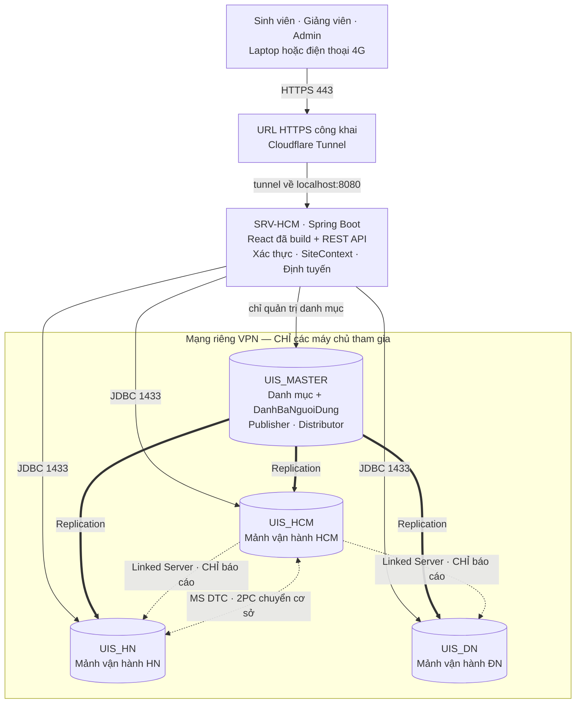
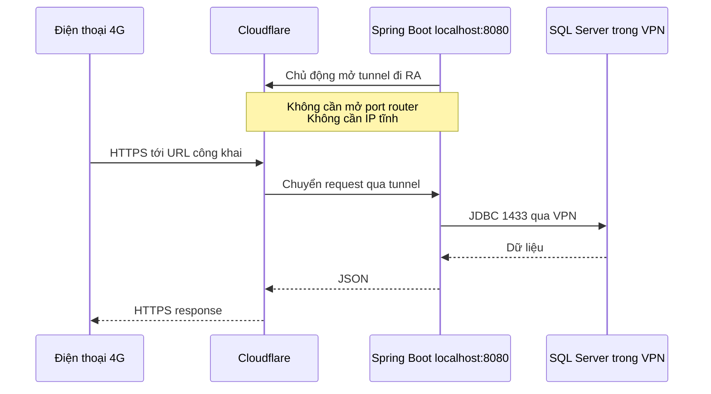
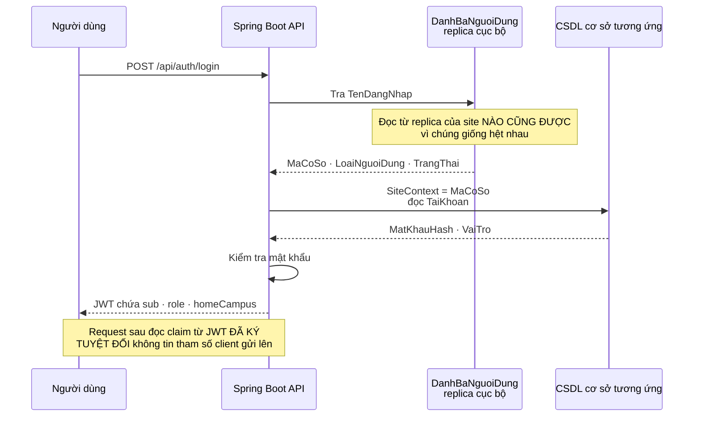
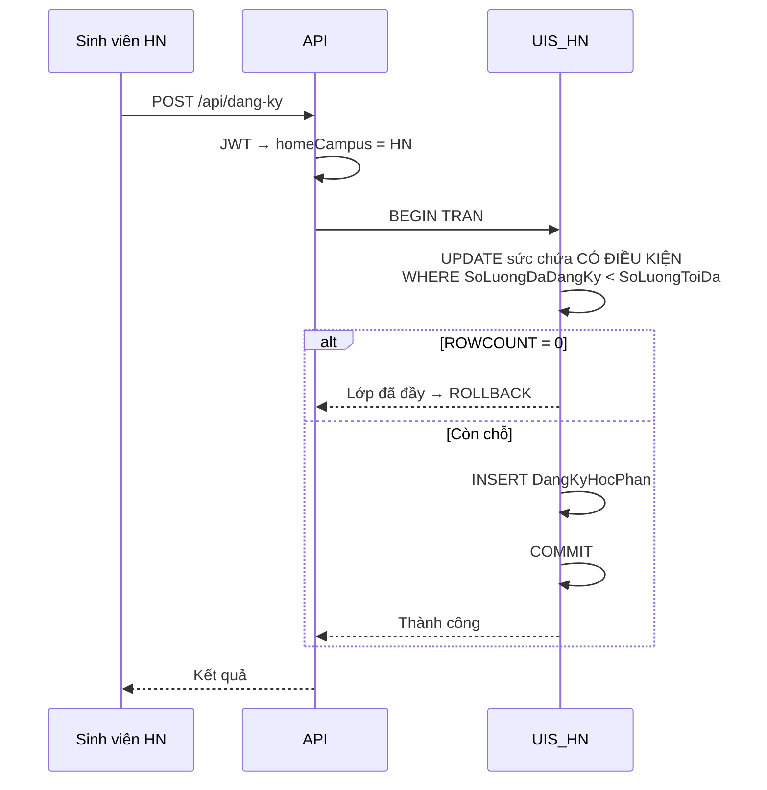
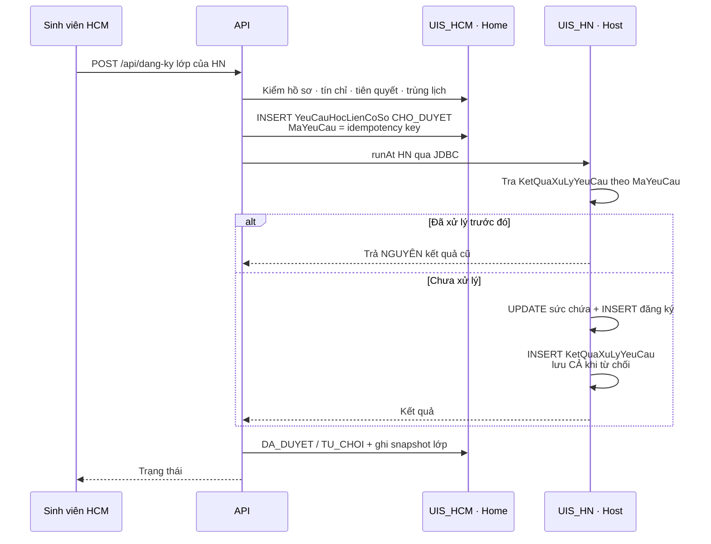
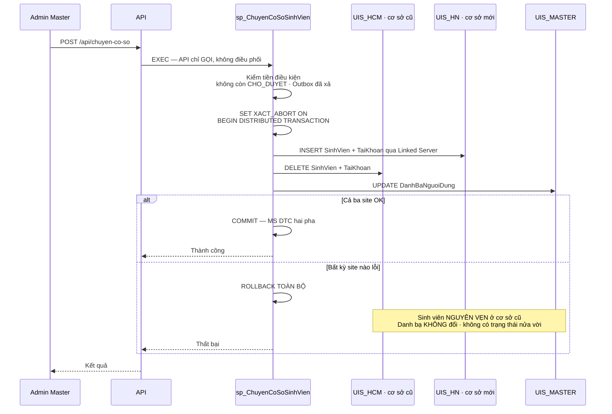
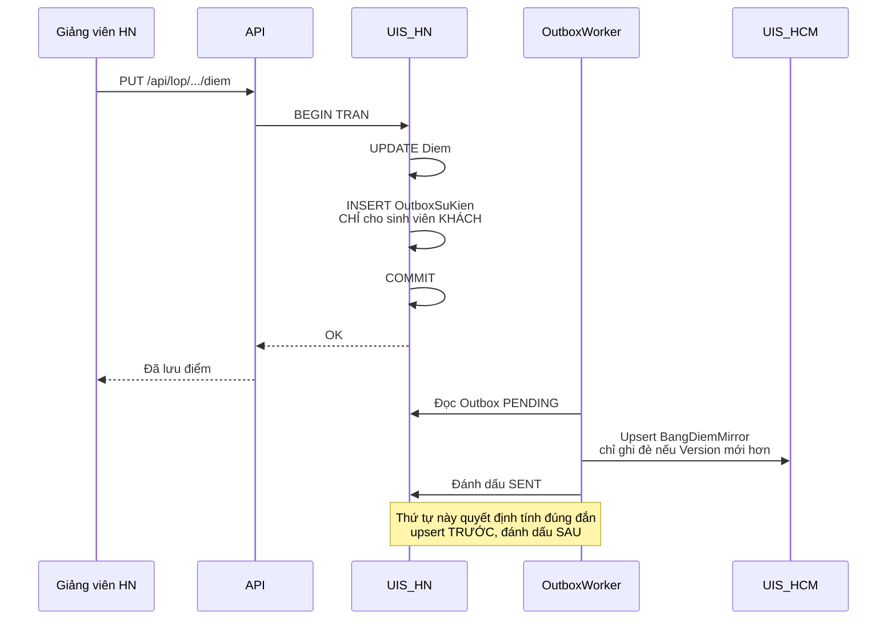
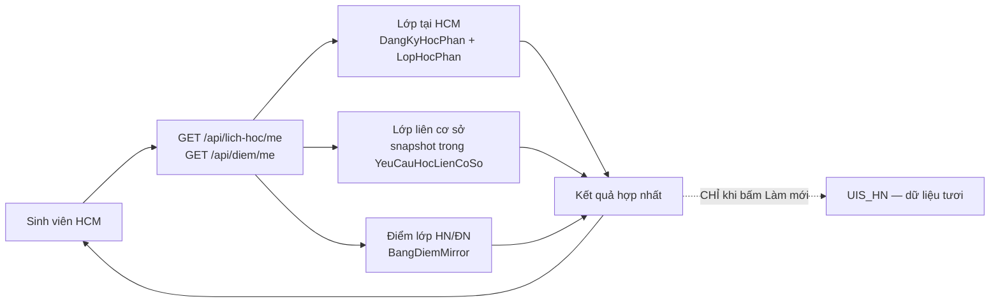
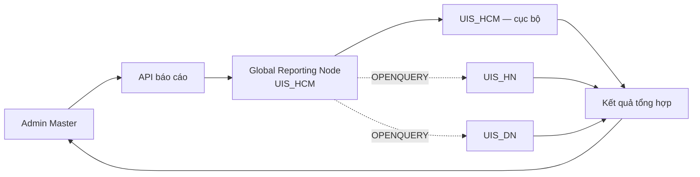

# UISPTITv2 — Quản lý đăng ký tín chỉ đa cơ sở

> Đồ án cuối kỳ môn **Cơ sở dữ liệu phân tán (CSDLPT)**
> Hệ thống đăng ký tín chỉ cho một trường đại học có nhiều cơ sở đào tạo, xây trên **SQL Server** với phân mảnh ngang, phân mảnh dẫn xuất, nhân bản một chiều và truy vấn phân tán.

---

## Bài toán

Một trường có nhiều cơ sở đào tạo đặt tại các tỉnh/thành khác nhau. Mỗi cơ sở vận hành gần như độc lập hằng ngày — tuyển sinh, mở lớp, giảng dạy, nhập điểm — nhưng vẫn dùng chung một chương trình đào tạo và cần thống kê toàn hệ thống.

**Bốn lý do bắt buộc phải phân tán:**

1. **Địa lý** — các cơ sở cách nhau ~1.700 km. Ràng buộc vật lý, không tối ưu bằng phần cứng được
2. **Tự chủ quản trị** — ranh giới quyền quản trị dữ liệu phải trùng ranh giới tổ chức
3. **Cô lập lỗi** — CSDL tập trung nghĩa là một sự cố ở trung tâm làm toàn bộ mọi cơ sở ngừng hoạt động
4. **Yêu cầu môn học**

---

## Kiến trúc



> **Người dùng chỉ biết một URL HTTPS. API biết Home/Host và chọn database. VPN chỉ nối các máy chủ với nhau. Database không bao giờ xuất hiện trước người dùng.**

**Hai chế độ ghi** — đây là điểm cốt lõi của thiết kế:

| Loại dữ liệu | Chế độ ghi |
|---|---|
| **Vận hành** — sinh viên, lớp học phần, đăng ký, điểm | **Mỗi cơ sở là master của chính mình.** Ghi độc lập hoàn toàn. ~99,9% lượt ghi |
| **Tham chiếu** — danh mục môn học, khoa, học kỳ, danh bạ | **Một nơi ghi, nhân bản ra mọi nơi.** ~15 lượt ghi/ngày |

Hệ thống **không** phải single-master. Ghi được phân hoạch theo mảnh cho dữ liệu nghiệp vụ, và single-master cho dữ liệu tham chiếu.

---

## ⭐ Năm yêu cầu bắt buộc

Đây là danh sách **phải có** — thiếu một mục là mất điểm nặng. Mọi thứ khác trong dự án đều là phần thêm.

| # | Yêu cầu | Hiện thực ở đâu | Mục |
|---|---|---|---|
| 1 | **1 phương pháp phân mảnh** | Phân mảnh ngang theo cơ sở *(có thêm dẫn xuất bậc 1 và bậc 2)* | C3 |
| 2 | **1 phương pháp replication** | Transactional Replication một chiều `UIS_MASTER` → Subscriber | D1 |
| 3 | **1 distributed transaction** | **2PC / MS DTC cho chuyển cơ sở sinh viên** — nguyên tử trên 3 CSDL | **D8** |
| 4 | **1 tình huống concurrency** | 100 luồng tranh 30 chỗ khi đăng ký học phần | D4 |
| 5 | **1 distributed query** | `OPENQUERY` thống kê toàn hệ thống qua Linked Server | D2 |

### Vì sao có cả 2PC lẫn Saga

Hệ thống dùng **hai cơ chế khác nhau cho hai nghiệp vụ khác nhau** — và giải thích được vì sao mỗi cái nằm ở chỗ của nó:

| | **Chuyển cơ sở sinh viên** | **Đăng ký liên cơ sở** |
|---|---|---|
| Cơ chế | **Distributed transaction (2PC)** | **Saga + idempotent receiver** |
| Tần suất | Vài lần mỗi kỳ | 32.000 lượt/ngày cao điểm |
| Tranh chấp | Không | Cao — tranh một dòng lớp |
| Trạng thái trung gian an toàn | **Không có** — sinh viên không thể "nửa ở HCM nửa ở HN" | Có — `CHO_DUYET` |

Benchmark **B5** đo cả hai trên cùng một nghiệp vụ để chứng minh lựa chọn này bằng số liệu.

---

## Kỹ thuật phân tán áp dụng

| Kỹ thuật | Áp dụng cho |
|---|---|
| **Phân mảnh ngang** | `SinhVien`, `GiangVien`, `TaiKhoan`, `DotDangKy`, `LopHocPhan` |
| **Phân mảnh ngang dẫn xuất** | `DangKyHocPhan` (bậc 1, `⋉ LopHocPhan`) · `Diem` (bậc 2) |
| **Nhân bản một chiều** | Danh mục dùng chung + **danh bạ định vị** `DanhBaNguoiDung` |
| **Giao dịch phân tán (2PC / MS DTC)** | **Chuyển cơ sở sinh viên** — nguyên tử trên 3 CSDL |
| **Linked Server** | Chỉ cho thống kê toàn hệ thống — `OPENQUERY` / `EXEC … AT` |
| **Tối ưu truy vấn phân tán** | Aggregate pushdown / semi-join, có benchmark đo bằng số liệu |
| **Xử lý tương tranh** | `UPDATE … WHERE SoLuongDaDangKy < SoLuongToiDa` + 4 lớp ràng buộc |
| **Saga + Outbox** | Đăng ký liên cơ sở — nơi 2PC sẽ giữ lock qua mạng và làm sụp thông lượng |
| **Ba mức trong suốt** | Fragmentation · Location · Replication transparency |

---

## Toàn cảnh luồng hoạt động

### Năm loại kết nối — và chỉ năm

| # | Kết nối | Giao thức · cổng | Mục đích |
|---|---|---|---|
| 1 | Người dùng → API | **HTTPS 443** | Mọi nghiệp vụ của SV/GV/Admin |
| 2 | API → CSDL | **JDBC/TDS 1433** qua VPN | Đọc/ghi nghiệp vụ, saga, duyệt catalog site khác |
| 3 | Master → Subscriber | **Replication** qua VPN | Đồng bộ danh mục + danh bạ |
| 4 | Reporting Node → site | **Linked Server** qua VPN | **Chỉ** báo cáo của Admin |
| 5 | Site ↔ Site | **MS DTC — TCP 135 + RPC động 49152–65535** | **Giao dịch phân tán** (chuyển cơ sở) |

⚠️ Loại 5 **không đi qua cổng 1433** — đây là hạ tầng riêng và là chỗ dễ quên nhất khi mở firewall.
⚠️ **Linked Server không phục vụ đăng nhập, đăng ký hay xem điểm.** Nó chỉ dành cho báo cáo của Admin.

### 1. Mở API ra Internet hoạt động thế nào

Máy chạy API nằm sau modem gia đình, không có IP công khai. Điện thoại 4G không thể gọi thẳng `192.168.1.10:8080`. Tunnel giải quyết bằng cách **mở kết nối từ trong ra**:



**Internet chỉ nhìn thấy HTTPS 443 của Cloudflare.** Cổng 1433 chỉ mở trên interface VPN, không bao giờ forward trên modem. Không public SSMS, SMB hay SQL Server Agent.

### 2. Đăng nhập — bài toán con gà và quả trứng

Muốn biết định tuyến vào CSDL nào thì phải biết người dùng thuộc cơ sở nào; muốn biết điều đó thì phải đọc CSDL. Danh bạ nhân bản chính là lời giải:



Danh bạ phủ **mọi vai trò**, không riêng sinh viên — nhờ vậy giảng viên và Admin không phải tự chọn cơ sở lúc đăng nhập, và Admin Master có chỗ ở hợp lệ (`TaiKhoanMaster` trong `UIS_MASTER`).

### 3. Đăng ký học phần cùng cơ sở — không 2PC, không Linked Server



Toàn bộ giao dịch nằm trong `UIS_HN` → không thể vượt sức chứa, và bấm hai lần bị chặn bởi `UNIQUE(MaSinhVien, MaLopHP)`.

### 4. Đăng ký liên cơ sở — Saga, không 2PC



**Mất mạng sau khi Host đã ghi nhận?** Home vẫn giữ `CHO_DUYET`, worker gửi lại cùng `MaYeuCau`, Host tra `KetQuaXuLyYeuCau` và trả đúng kết quả cũ — **không tăng sĩ số lần hai**.
**Host đang tắt?** Sinh viên thấy "đang chờ cơ sở HN", không khoá tài nguyên nào ở Home.

### 5. ⭐ Chuyển cơ sở sinh viên — GIAO DỊCH PHÂN TÁN (yêu cầu bắt buộc số 3)

Đây là luồng duy nhất mà **API không điều phối** — nó chỉ gọi một stored procedure, còn SQL Server tự lo 2 pha qua MS DTC:



**Khác biệt với saga:** saga để lại trạng thái trung gian cần bù trừ; 2PC thì **hoặc xong hết, hoặc như chưa từng xảy ra**.

### 6. Nhập điểm và Outbox



Sinh viên có cơ sở nhà **trùng** site đang nhập điểm thì `Diem` đã nằm đúng chỗ — không cần event. Với tỉ lệ liên cơ sở ~2%, điều này cắt ~98% lượng Outbox.

### 7. Đọc thời khóa biểu và bảng điểm — thuần cục bộ



**Không fan-out mặc định.** HN tắt thì sinh viên vẫn xem được, kèm nhãn *"đồng bộ từ HN lúc 14:32"*. Mirror lo **tính sẵn sàng**, fan-out lo **độ tươi**.

### 8. Báo cáo toàn hệ thống — nơi duy nhất dùng Linked Server



`GROUP BY` chạy **tại từng site**, chỉ kết quả rút gọn đi qua mạng. Sinh viên và giảng viên không bao giờ kích hoạt được Linked Server.

### 9. Khi một máy tắt thì chức năng nào còn chạy

| Sự cố | Kết quả |
|---|---|
| **`UIS_MASTER` tắt** | ✅ Đăng nhập, đăng ký, xem lịch, nhập điểm **vẫn chạy** bằng replica. Chỉ mất: sửa danh mục, nhân bản thay đổi mới, báo cáo tổng hợp |
| **`UIS_HN` tắt** | HCM và ĐN chạy bình thường; sinh viên HN không thao tác được (tài khoản nằm tại HN) |
| HN tắt khi SV HCM đăng ký lớp HN | Yêu cầu giữ `CHO_DUYET`, worker retry sau |
| HN tắt khi SV HCM xem lịch / điểm | ✅ Vẫn xem được từ snapshot và mirror, có thể hơi cũ |
| **Máy API tắt** | ❌ Toàn bộ website ngừng — **điểm chết đơn lẻ của kiến trúc một API** |
| Tunnel tắt | Không vào được từ Internet; LAN/VPN vẫn gọi API bình thường |

> `UIS_MASTER` là **SPOF của control plane, không phải SPOF của data plane** — đó là đánh đổi được chấp nhận có chủ đích.

---

## Điểm đặc biệt: X-Ray Phân Tán

Môn CSDLPT dạy toàn những thứ **không nhìn thấy được**. X-Ray làm chúng hiện ra theo thời gian thực — mọi response mang theo một trace, giao diện vẽ lại đúng đường đi của request đó qua hệ thống:

```
┌─ X-RAY ──────────────────────────────────────────────┐
│  GET /api/thong-ke/mon-hoc?ma=INT1339                 │
│                                                        │
│      [HCM] ●━━━━━━━  cục bộ      ·  1 dòng ·   9ms    │
│      [HN ] ●━━━━━━━  OPENQUERY   ·  1 dòng ·  87ms    │
│      [ĐN ] ●━━━━━━━  OPENQUERY   ·  1 dòng ·  91ms    │
│                                                        │
│  Dòng qua mạng: 2   (đã GROUP BY tại từng site)       │
│  Chiến lược: OPENQUERY      [ đổi sang four-part ]    │
└────────────────────────────────────────────────────────┘
```

Bấm *"đổi sang four-part"* — cùng câu hỏi, hiện ngay **84.213 dòng qua mạng · 3.412ms**. Benchmark không còn là bảng tĩnh trong báo cáo mà là thứ chạy được trực tiếp.

---

## Cấu trúc repo

```
uisptitv2/
├── docs/
│   ├── UISPTITv2-Thiet-Ke-v2.md   ← TÀI LIỆU DUY NHẤT của dự án
│   ├── bao-cao/                    ← bản Word nộp thầy
│   ├── diagrams/                   ← ERD, lược đồ phân mảnh/ánh xạ/định vị
│   └── screenshots/                ← ảnh cài đặt từng bước (chụp từ tuần 1)
├── db/
│   ├── 00-create-databases.sql     ← UIS_MASTER · UIS_HCM · UIS_HN · UIS_DN
│   ├── 01-schema-master.sql        02-schema-site.sql
│   ├── 03-roles-grants.sql         04-triggers.sql
│   ├── 05-linked-server.sql        06-replication/
│   └── 99-seed/
├── apps/
│   ├── api/                        ← Spring Boot (modular monolith)
│   └── web/                        ← React + Vite
└── bench/                          ← sinh tải + kịch bản benchmark
```

---

## Bắt đầu từ đâu

Toàn bộ thiết kế nằm trong **một tài liệu duy nhất**: [`docs/UISPTITv2-Thiet-Ke-v2.md`](docs/UISPTITv2-Thiet-Ke-v2.md)

| Bạn đang cần… | Đọc mục |
|---|---|
| Nắm nhanh dự án trong 5 phút | Mục **Toàn cảnh luồng hoạt động** ngay trong README này |
| Hiểu chi tiết một quyết định | **0.1** bảng quyết định · **0.2** X-Ray · **C0** hai chế độ ghi |
| Viết báo cáo mục 2.1 / 2.2.1 / 2.2.2 | **Phần A** / **B** / **C** |
| Làm cài đặt vật lý (mục 3 đề bài) | **Phần F** chi tiết · **I5** checklist tick nhanh |
| ⭐ Biết đâu là phần **không được phép thiếu** | **0.1b** — năm yêu cầu bắt buộc |
| Tra nhanh một bảng | **I6** danh sách bảng |
| Biết còn gì chưa chốt | **I4** việc còn treo |
| Lo về máy móc, chi phí, uptime | **I2b** vận hành máy chủ |

---

## Yêu cầu môi trường

| Hạng mục | Yêu cầu |
|---|---|
| CSDL | **SQL Server Developer Edition** — bắt buộc. Express không làm được Publisher và không có SQL Server Agent |
| Máy | 2–4 máy Windows 10/11 · 8GB RAM · 20GB đĩa trống |
| Mạng | Radmin VPN (hoặc Tailscale) — **chỉ nối các máy chủ**, thiết bị người dùng không tham gia |
| Backend | JDK 17+ · Maven |
| Frontend | Node 20+ |
| **Chi phí hạ tầng** | **0đ** — chạy hoàn toàn trên máy của nhóm |

> Hệ thống **không cần chạy 24/7**. Với retention đã cấu hình (subscription expiration 30 ngày), một máy có thể tắt tới 30 ngày mà vẫn bắt kịp. Chi tiết ở mục **I2b**.

---

## Cài đặt & chạy

### 0. Công cụ cần cài

| Công cụ | Bản | Ghi chú |
|---|---|---|
| **SQL Server Developer Edition** | 2019 / 2022 | Miễn phí. **Không dùng Express** |
| **SSMS** (SQL Server Management Studio) | mới nhất | Dùng cho wizard Replication — bước bắt buộc chụp màn hình |
| **JDK** | 17 hoặc 21 | Temurin / Microsoft Build of OpenJDK |
| **Maven** | 3.9+ | Hoặc dùng `mvnw` kèm sẵn trong project |
| **Node.js** | 20 LTS | Kèm npm |
| **Radmin VPN** | mới nhất | Hoặc Tailscale |
| IDE | tuỳ chọn | IntelliJ Community · VS Code · Visual Studio Community — đều miễn phí |

### 1. Máy chủ CSDL — tự dựng theo Phần F

Phần này cố tình để **khái quát** — mỗi người tự tìm hiểu và làm theo checklist, vì đây chính là ~40% điểm và là thứ phải tự tay làm mới hiểu.

Thứ tự việc:

1. Cài SQL Server Developer trên từng máy, bật **Mixed Mode**, mở **TCP 1433**, collation `Vietnamese_CI_AS`
2. Nối các máy bằng VPN, thêm entry vào `hosts` (replication lưu **tên máy**, không lưu IP)
3. Bật **SQL Server Agent**, đặt `Automatic`, và xử lý tài khoản chạy Agent trong môi trường workgroup
4. Tạo 4 database: `UIS_MASTER`, `UIS_HCM`, `UIS_HN`, `UIS_DN`
5. Chạy script trong `db/` theo thứ tự số
6. Tạo **Linked Server**, rồi **Publication** trên `UIS_MASTER` và các **Subscription**

> 📖 Chi tiết từng bước, kèm cái bẫy ở mỗi bước: **Phần F** trong tài liệu thiết kế.
> ✅ Bản tick nhanh để vừa làm vừa đánh dấu: **mục I5**.

### 2. Backend — `apps/api` (Spring Boot)

**Tạo project** tại [start.spring.io](https://start.spring.io) với: `Spring Web`, `JDBC API`, `Validation`, `Spring Security`, `Flyway Migration`.

Thêm driver SQL Server và JWT vào `pom.xml`:

```xml
<dependency>
  <groupId>com.microsoft.sqlserver</groupId>
  <artifactId>mssql-jdbc</artifactId>
  <scope>runtime</scope>
</dependency>
<dependency>
  <groupId>io.jsonwebtoken</groupId>
  <artifactId>jjwt-api</artifactId>
  <version>0.12.6</version>
</dependency>
```

**Khai báo các site** — `application.yml`. Mỗi site một DataSource, mật khẩu lấy từ biến môi trường:

```yaml
uis:
  sites:
    MASTER:
      url: "jdbc:sqlserver://SRV-HCM:1433;databaseName=UIS_MASTER;encrypt=true;trustServerCertificate=true"
      username: uis_app
      password: ${UIS_DB_PASSWORD}
    HCM:
      url: "jdbc:sqlserver://SRV-HCM:1433;databaseName=UIS_HCM;encrypt=true;trustServerCertificate=true"
      username: uis_app
      password: ${UIS_DB_PASSWORD}
    HN:
      url: "jdbc:sqlserver://SRV-HN:1433;databaseName=UIS_HN;encrypt=true;trustServerCertificate=true"
      username: uis_app
      password: ${UIS_DB_PASSWORD}
    DN:
      url: "jdbc:sqlserver://SRV-DN:1433;databaseName=UIS_DN;encrypt=true;trustServerCertificate=true"
      username: uis_app
      password: ${UIS_DB_PASSWORD}

spring:
  datasource:
    hikari:
      maximum-pool-size: 10
      connection-timeout: 3000        # site chết thì fail nhanh, không hút cạn thread pool
      initialization-fail-timeout: -1 # ⚠️ BẮT BUỘC: app vẫn khởi động được khi một site đang tắt
```

⚠️ Hai dòng cuối không phải trang trí — thiếu chúng thì **ứng dụng không khởi động nổi khi một site tắt**, và kịch bản demo "tắt một site mà hệ thống vẫn chạy" (mục D6) sẽ hỏng ngay trước mặt giám khảo.

**Định tuyến theo site** — đây là phần cốt lõi, hiện thân của Location Transparency:

```java
// Xác định site hiện tại của request (đọc từ JWT claim homeCampus)
public final class SiteContext {
    private static final ThreadLocal<String> CURRENT = new ThreadLocal<>();

    public static void set(String maCoSo) { CURRENT.set(maCoSo); }
    public static String get()            { return CURRENT.get(); }
    public static void clear()            { CURRENT.remove(); }

    /** Chạy một khối lệnh trên site chỉ định — dùng cho ghi liên cơ sở */
    public static <T> T runAt(String maCoSo, Supplier<T> action) {
        String truoc = CURRENT.get();
        CURRENT.set(maCoSo);
        try { return action.get(); } finally { CURRENT.set(truoc); }
    }
}

// Spring tự chọn DataSource theo giá trị SiteContext
public class SiteRoutingDataSource extends AbstractRoutingDataSource {
    @Override protected Object determineCurrentLookupKey() {
        return SiteContext.get();
    }
}
```

⚠️ **Một giao dịch không bao giờ được trải trên hai site.** `AbstractRoutingDataSource` phân giải khóa **một lần** khi lấy connection đầu tiên; đổi site giữa chừng trong `@Transactional` sẽ ghi nhầm site hoặc mất tính nguyên tử **mà không ném ra lỗi nào**. Ghép nhiều site bằng saga ở tầng ứng dụng (mục D3), không bằng transaction.

**Chạy:**

```bash
cd apps/api
./mvnw spring-boot:run          # http://localhost:8080
```

### 3. Frontend — `apps/web` (React + Vite)

```bash
npm create vite@latest web -- --template react-ts
cd web && npm install
```

Trỏ API về backend — `vite.config.ts`:

```ts
export default defineConfig({
  plugins: [react()],
  server: {
    proxy: { "/api": "http://localhost:8080" }
  }
});
```

```bash
npm run dev                     # http://localhost:5173
```

> ⚠️ **Giữ frontend tối giản.** Không shadcn/ui, không state library, không router phức tạp — chỉ `fetch` + `useState` + bảng và form. Barem chấm ở tầng CSDL; mỗi giờ dành cho UI là một giờ không dành cho replication đang gãy.

### 4. Truy cập từ máy khác

Một UIS thật thì sinh viên gọi API qua HTTPS từ bất kỳ đâu — nhưng **CSDL của nó không bao giờ mở ra internet**, nó nằm trong mạng nội bộ của trường. **VPN trong dự án này chính là mạng nội bộ đó.** Thứ cần thêm chỉ là lối vào công khai cho tầng API.

```
Sinh viên (bất kỳ đâu)  ──HTTPS──►  Tầng API  ──VPN──►  CSDL các cơ sở
                                    (công khai)          (luôn kín)
```

**Năm loại kết nối trong hệ thống:**

| Kết nối | Giao thức · cổng | Mục đích |
|---|---|---|
| Người dùng → API | HTTPS 443 | Mọi nghiệp vụ |
| API → CSDL | JDBC/TDS 1433 qua VPN | Đọc/ghi nghiệp vụ |
| Master → Subscriber | Replication qua VPN | Đồng bộ danh mục + danh bạ |
| Reporting Node → site | Linked Server qua VPN | **Chỉ** báo cáo Admin |
| Site ↔ Site | **MS DTC — TCP 135 + RPC động** | **Giao dịch phân tán** (chuyển cơ sở) |

⚠️ **Thiết bị người dùng không tham gia VPN.** Chỉ máy chủ nối VPN với nhau; người dùng chỉ thấy một URL HTTPS.

| Tình huống | Cách | Địa chỉ |
|---|---|---|
| Demo trong phòng, cùng wifi | Mở firewall cổng 8080 trên máy chạy API | `http://192.168.x.x:8080` |
| Nhóm làm ở nhà, khác địa điểm | Mọi người vào cùng mạng VPN | `http://26.x.x.x:8080` |
| **Bất kỳ đâu, qua internet** | Tunnel miễn phí trên máy chạy API | `https://<tên>.trycloudflare.com` |

```bash
cloudflared tunnel --url http://localhost:8080
```

Một lệnh là có URL HTTPS công khai — không cần IP tĩnh, không mở port router, không tốn tiền. Máy chạy API vẫn ở trong VPN để với tới CSDL.

**Ba cái bẫy khi chạy nhiều máy:**

1. **Vite chỉ nghe `127.0.0.1`** → máy khác không vào được frontend. Đặt `server: { host: true }`, và proxy phải trỏ về **IP máy chạy API**, không phải `localhost`
2. **Windows Firewall chặn cổng 8080** — chỉ khi truy cập qua **LAN hoặc VPN**. ⚠️ Dùng Cloudflare Tunnel trên cùng máy thì **không cần** lệnh này, vì `cloudflared` gọi `localhost`:
   ```powershell
   New-NetFirewallRule -DisplayName "UIS API 8080" -Direction Inbound `
     -Protocol TCP -LocalPort 8080 -Action Allow
   ```
3. **CORS** — không phát sinh nếu gộp frontend vào backend, hoặc đi qua proxy Vite

> ⭐ **Khuyến nghị cho demo: gộp frontend vào backend.** `npm run build` rồi chép `dist/*` vào `apps/api/src/main/resources/static/`. Một server, một cổng, một URL — không CORS, không proxy, không phải chạy hai tiến trình.

⚠️ **Nếu mở ra internet:** mật khẩu CSDL mạnh · `.env` không bao giờ commit (repo đang công khai) · không để lộ Swagger/Actuator · **cổng 1433 chỉ mở trên interface VPN, không bao giờ forward trên modem** · tunnel chỉ bật lúc demo, **không phải cổng vào production** (URL ngẫu nhiên, không WAF, không rate-limit).

### 5. Biến môi trường

Tạo `apps/api/.env` (đã được `.gitignore` chặn — **không bao giờ commit**):

```bash
UIS_DB_PASSWORD=matkhau_cua_ban
JWT_SECRET=chuoi_bi_mat_dai_it_nhat_32_ky_tu
```

Commit kèm một file `.env.example` chỉ có tên biến, không có giá trị, để người mới biết cần khai báo gì.

---

## Trạng thái

✅ **THIẾT KẾ ĐÃ CHỐT** — chưa bắt đầu cài đặt.

Mọi thay đổi thiết kế từ đây phải qua thảo luận nhóm và ghi vào bảng quyết định (mục 0.1 của tài liệu thiết kế).

Nguyên tắc thi công: **không viết dòng code ứng dụng nào trước khi phần cài đặt vật lý đã PASS và đã chụp đủ screenshot.**

Việc còn treo — xem mục **I4**:

- [ ] File Excel phân công đề tài của giảng viên
- [ ] Tài liệu hướng dẫn Replication của giảng viên
- [ ] Số liệu quy mô thật (thay giả định trong bảng tần suất)
- [ ] Chốt số cơ sở và kiểu instance — cuối tuần 1, sau spike
- [ ] ⭐ Xác nhận năm yêu cầu bắt buộc với giảng viên, nhất là yêu cầu 3 (giao dịch phân tán)
- [ ] Chốt người giữ máy chủ từng site + lịch buổi làm việc cố định

---

## Lộ trình

| Tuần | Trọng tâm | |
|---|---|---|
| 1 | Phân tích · ERD · bảng tần suất · **spike replication + MS DTC (cổng chặn)** | Bắt buộc |
| 2 | Thiết kế phân mảnh/ánh xạ/định vị · schema · seed dữ liệu | Bắt buộc |
| 3 | **Cài đặt vật lý** — VPN · **MS DTC** · Linked Server · Publication | Bắt buộc |
| 4 | Trigger · phân quyền · transaction · test tương tranh · **giao dịch phân tán** | Bắt buộc |
| 5 | Ứng dụng nền tảng | Mở rộng |
| 6 | Đăng ký liên cơ sở — saga · outbox · projection | Mở rộng |
| 7 | X-Ray · benchmark · kịch bản sự cố | Mở rộng |
| 8 | Báo cáo · slide · demo · tuần đệm | Bắt buộc |

⚠️ **Cổng chặn cuối tuần 4:** phần bắt buộc phải xong trước khi đụng vào phần mở rộng.

---

# Quy trình làm việc với Git

> Mục này dành cho **mọi thành viên**. Đọc hết một lần trước khi commit dòng đầu tiên.

## Cấu trúc nhánh

Dự án dùng 3 tầng nhánh. Code đi từ dưới lên trên, **không bao giờ đi ngược lại**.

```
feature/ten-tinh-nang  ──PR──►  dev  ──PR (cuối mỗi tuần)──►  main
```

| Nhánh | Vai trò | Ai được đẩy code vào |
|---|---|---|
| `main` | Code luôn chạy ổn định, là bản đem đi demo/bảo vệ **bất cứ lúc nào**. Chỉ merge từ `dev` vào cuối mỗi mốc tuần | Không ai push thẳng. Chỉ merge PR từ `dev` |
| `dev` | Nhánh tích hợp chung. Mọi thứ merge vào đây trước để các phần ghép với nhau và test chung | Không ai push thẳng. Chỉ merge PR từ `feature/*` |
| `feature/<ten>` | Nhánh riêng của từng người cho từng task. Xong task thì mở PR vào `dev` rồi xoá nhánh | Người phụ trách task đó |

Đặt tên nhánh theo module, chữ thường, nối bằng gạch ngang:

```
db/schema              db/trigger-role         db/replication
db/linked-server       db/seed
api/core               api/dang-ky             api/lien-co-so
api/xray               web/sinh-vien           web/admin
bench/benchmark        docs/phan-b             docs/phan-c
```

**Một nhánh = một task.** Đừng gom 3 việc vào một nhánh — PR sẽ to, khó review, và dễ conflict.

## Quy tắc bắt buộc

1. **Không push trực tiếp vào `main` và `dev`.** Repo đã bật branch protection nên bạn sẽ bị chặn tự động — thấy lỗi `protected branch hook declined` nghĩa là **bạn đang đứng nhầm nhánh**, không phải lỗi máy.
2. **Mọi thay đổi phải đi qua Pull Request.** Không có ngoại lệ, kể cả sửa một dòng.
3. **Tự test kỹ trên máy mình trước khi merge.** Chạy được, không lỗi, không làm hỏng phần người khác — trách nhiệm của người mở PR.
4. **Không merge PR khi còn conflict.**

### Repo đang bật gì

Bảo vệ nhánh dùng **Rulesets** (Settings → Rules → Rulesets), không dùng branch protection kiểu cũ:

| Ruleset | Áp cho | Rule đang bật |
|---|---|---|
| `main - can approval cua owner` | `refs/heads/main` | Bắt buộc PR · **1 approval** · **CODEOWNERS** phải duyệt · gỡ approve khi push thêm · cấm xoá nhánh · cấm force-push |
| `dev - bat buoc PR, khong can approval` | `refs/heads/dev` | Bắt buộc PR · **0 approval** (tự merge sau khi test) · cấm xoá nhánh · cấm force-push |

Cả hai ruleset đều có **bypass cho vai trò Admin** ở chế độ *Always* — owner vẫn push thẳng được khi thật sự cần. Đây là lối thoát hiểm, **không phải cách làm việc hằng ngày**: mọi thay đổi bình thường vẫn đi qua PR.

> ⚠️ **Vì sao owner cần bypass:** GitHub không cho tự approve PR của chính mình. Khi chỉ có owner làm việc, PR `dev → main` sẽ không ai duyệt được. Bypass gỡ bế tắc đó. Khi nhóm đã có đủ người, hãy để thành viên khác approve cho đúng quy trình.

### Mức duyệt khác nhau giữa hai nhánh

| PR vào | Cần approval? | Ai merge |
|---|---|---|
| `dev` | **Không bắt buộc** | Tự merge sau khi đã test xong trên máy |
| `main` (cuối tuần) | **Cần approval của owner** | Owner merge, sau khi cả nhóm đã test trên `dev` |

Vào `dev` thì nhanh — mở PR rồi tự bấm merge, không phải chờ ai. Đổi lại **bạn chịu trách nhiệm hoàn toàn** cho việc code chạy được. PR ở đây tồn tại để cả nhóm nhìn thấy ai đổi gì, không phải để làm khó nhau.

Còn `main` là bản đem đi bảo vệ, nên cuối mỗi mốc tuần mới gộp và phải có approval của owner. File `.github/CODEOWNERS` chỉ định owner duyệt cho toàn repo, nên approval của thành viên khác **không thay thế được**.

### Cách review

Mở PR → tab **Files changed** → nút **Review changes** (góc trên bên phải):

| Lựa chọn | Ý nghĩa | Ảnh hưởng tới nút Merge |
|---|---|---|
| **Comment** | Góp ý, chưa kết luận | Không đổi gì |
| **Approve** | Đồng ý cho merge | ✅ Bắt buộc với PR vào `main` |
| **Request changes** | Yêu cầu sửa trước khi merge | ❌ **Khoá cứng PR** cho tới khi chính người đó approve lại |

⚠️ **Cẩn thận với Request changes** — dùng nhầm là PR đứng hình, người khác approve cũng không cứu được. Góp ý bình thường thì chọn **Comment**.

⚠️ **Approve bị gỡ nếu nhánh có commit mới.** Repo bật *dismiss stale reviews*, nên mỗi lần push thêm là approval cũ tự mất. Với PR vào `main`: sync và push xong xuôi **rồi mới** nhờ duyệt.

Sau khi PR được merge, GitHub **tự xoá nhánh feature trên remote** — bạn chỉ cần dọn nhánh dưới máy mình.

## Các bước làm việc hàng ngày

```bash
# 1. Trước khi bắt đầu, cập nhật dev mới nhất
git checkout dev
git pull origin dev

# 2. Tạo nhánh riêng cho task đang làm
git checkout -b db/trigger-role

# 3. Code, commit theo từng phần nhỏ, rõ ràng
git add .
git commit -m "feat: them trigger chan ghi bang nhan ban o subscriber"

# 4. Trước khi mở PR, cập nhật lại từ dev để giảm conflict
git checkout dev
git pull origin dev
git checkout db/trigger-role
git merge dev

# 5. Push nhánh lên GitHub
git push origin db/trigger-role

# 6. Vào GitHub mở Pull Request từ nhánh này vào dev
#    - Mô tả ngắn: task này làm gì, cách test thử
#    - Chạy lại một lần nữa trên máy mình -> ok thì tự bấm Merge
#    - Phần khó hoặc động vào db/ dùng chung: tag một người xem giúp trước
```

Sau khi PR được merge, dọn nhánh cũ:

```bash
git checkout dev
git pull origin dev
git fetch --prune                    # dọn tham chiếu tới nhánh đã bị xoá trên GitHub
git branch -d db/trigger-role        # xoá nhánh ở máy mình
```

## Quy ước đặt tên commit

Dùng Conventional Commits rút gọn: `<loại>: <mô tả ngắn gọn>`

| Loại | Dùng khi | Ví dụ |
|---|---|---|
| `feat` | Thêm tính năng mới | `feat: them saga dang ky lien co so` |
| `fix` | Sửa lỗi | `fix: sua bo dem si so nhay 2 moi lan dang ky` |
| `docs` | Sửa tài liệu/README | `docs: bo sung bang tan suat truy cap` |
| `db` | Schema, trigger, script SQL | `db: them rang buoc check suc chua lop` |
| `refactor` | Sửa code không đổi chức năng | `refactor: tach routing datasource ra rieng` |
| `test` | Thêm/sửa test | `test: them test 100 luong tranh 30 cho` |
| `chore` | Việc lặt vặt, cấu hình | `chore: them flyway vao apps/api` |

Mô tả viết ở thì hiện tại, nói việc đã làm, dưới 72 ký tự, không viết hoa đầu câu, không chấm cuối câu:

```
❌  update  ·  fix bug  ·  sua lai code
✅  feat: them bo loc lop hoc phan theo hoc ky
```

## Xử lý conflict

Conflict xảy ra khi hai người cùng sửa một chỗ trong một file. Chuyện bình thường, không phải ai làm sai.

> **Nguyên tắc: người tạo ra conflict tự resolve trên máy mình, test lại rồi mới push.** Đừng đẩy conflict sang cho người review.

Khi `git merge dev` ở bước 4 báo conflict:

```bash
git status                     # xem file nào đang conflict
# Mở từng file, tìm dấu <<<<<<<  =======  >>>>>>>
# Giữ lại phần đúng, xoá hết dấu phân cách
git add <file-da-sua>
git commit                     # hoàn tất merge
# CHẠY LẠI + TEST trước khi push
```

Rối quá thì quay lại trạng thái trước khi merge:

```bash
git merge --abort
```

### ⚠️ Ba chỗ dễ conflict nhất của dự án này

**1. `docs/UISPTITv2-Thiet-Ke-v2.md` — nguy hiểm nhất.**
Đây là tài liệu duy nhất, gần 1.900 dòng, và **cả 5 người đều viết báo cáo từ nó**. Cách tránh:

- **Chia theo mục, không chia theo file.** Mỗi người chỉ sửa mục được phân công (người làm Phần B không đụng Phần C)
- Nhánh tài liệu phải **ngắn ngày** — sửa xong mục nào merge ngay, đừng ôm một tuần
- `git pull origin dev` **ngay trước khi** bắt đầu sửa, không phải lúc chuẩn bị push

**2. `db/02-schema-site.sql` và các script trong `db/`.**
Cả nhóm đều động vào. Nếu cần đổi schema, **báo nhóm trước trong group chat** rồi mới sửa. Một người sửa xong và merge vào `dev`, những người khác chạy:

```bash
git pull origin dev
# rồi chạy lại script db/ trên CSDL local của mình
# (hoặc: mvn -f apps/api flyway:migrate  khi đã có Flyway)
```

**3. `docs/screenshots/` — ảnh không merge được.**
File nhị phân, git không gộp được, và hai người chụp cùng một bước sẽ đè lên nhau. Quy ước đặt tên:

```
docs/screenshots/05-publication/05-01-chon-publisher.png
docs/screenshots/05-publication/05-02-chon-article.png
```

Đánh số theo **bước**, không theo người. Trước khi chụp, xem thư mục đã có ảnh bước đó chưa.

## Phân công nhánh theo module

| Nhánh | Module | Người phụ trách |
|---|---|---|
| `db/schema` | Schema, ràng buộc, khóa | *(điền tên)* |
| `db/trigger-role` | Trigger toàn vẹn site, database role, phân quyền | *(điền tên)* |
| `db/replication` | Publication, subscription, retention | *(điền tên)* |
| `db/linked-server` | Linked Server, 4 báo cáo tổng hợp | *(điền tên)* |
| `db/seed` | Sinh dữ liệu lớn | *(điền tên)* |
| `api/core` | SiteContext, routing datasource, 3 port | *(điền tên)* |
| `api/dang-ky` | Đăng ký học phần, chống overbooking | *(điền tên)* |
| `api/lien-co-so` | Saga, outbox, projection | *(điền tên)* |
| `api/xray` | X-Ray Phân Tán | *(điền tên)* |
| `web/*` | Giao diện | *(điền tên)* |
| `bench/benchmark` | Sinh tải, đo đạc | *(điền tên)* |
| `docs/*` | Tài liệu, báo cáo, sơ đồ | *(điền tên)* |

Nhận task nào thì điền tên vào đó để tránh hai người làm trùng.

---

# Giấy phép

MIT — dự án học tập, dùng lại thoải mái.
